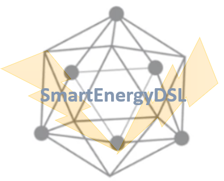
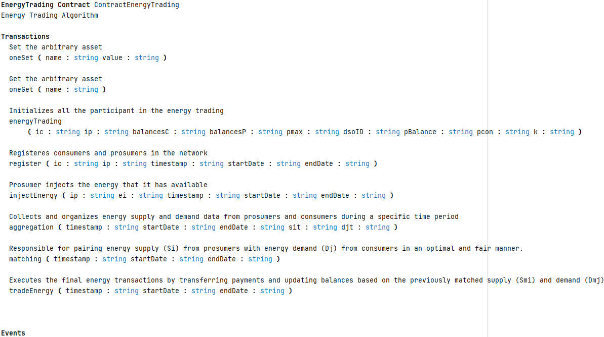
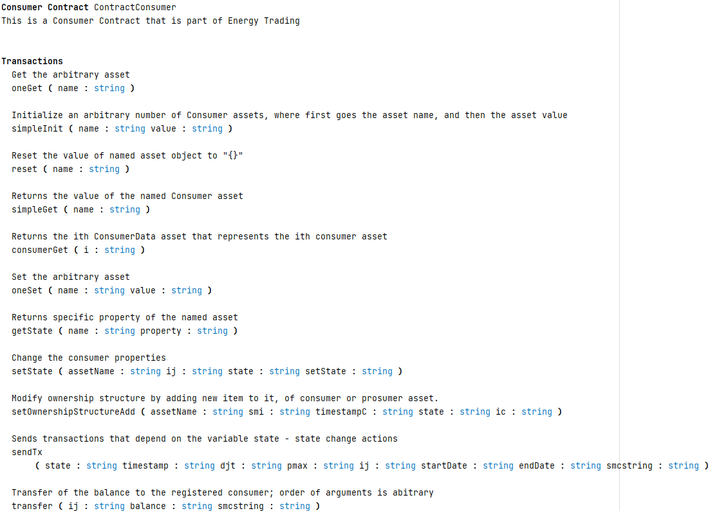
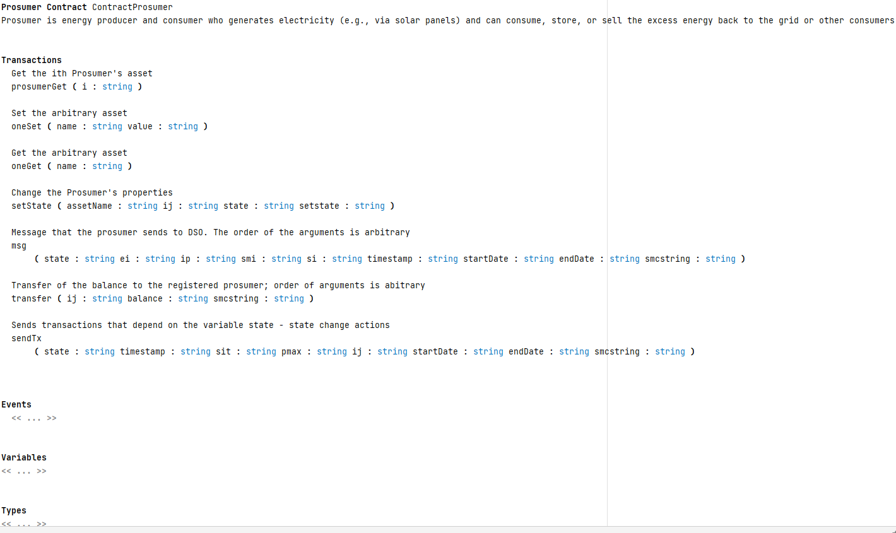
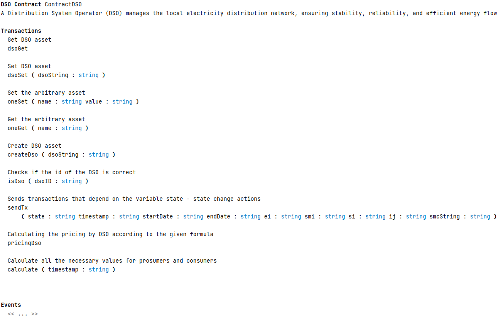
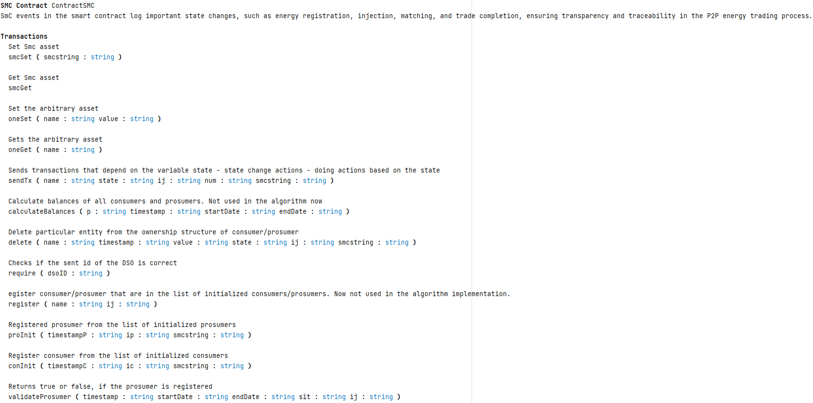
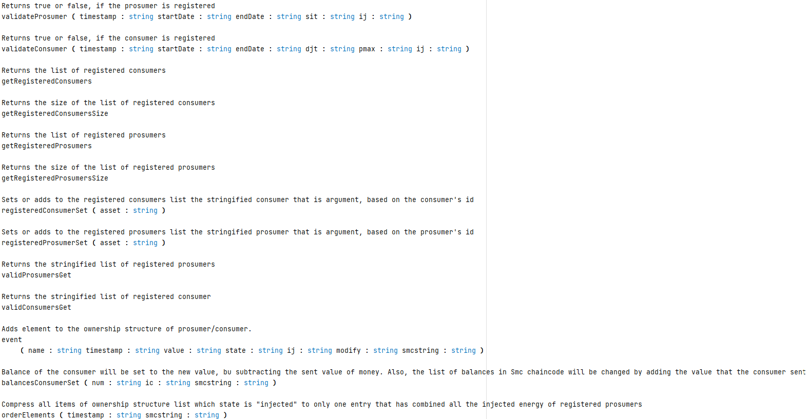

<div align="center">
  
  

  
# SmartEnergyDSL- Energy Light-DSL in MPS and KernelF

---

## The project includes the *Light-DSL for Energy p2p trading* with minimal DSO intervention in *Hyperledger Fabric Blockchain* as well as part with generator in pure Java for different energy trading algorithms 
</div>
<div align="justify">

---

## Contents

- [Introduction](#Introduction)
- [Generated Java and Java Fabric code](#Generated-Java-and-Java-Fabric-code)
- [Video materials](#Video-materials)
- [Quick Introduction to the Blockchain-oriented Part of the SmartEnergyDSL](#Quick-Introduction-to-the-Blockchain-oriented-Part-of-the-SmartEnergyDSL)
- [Primary Use Case of SmartEnergyDSL: Executing an Energy Trade](#Primary-Use-Case-of-SmartEnergyDSL--Executing-an-Energy-Trade)
- [Chaincodes](#Chaincodes)
- [Hyperledger Fabric: command line invocations in test network](#Hyperledger-Fabric--Command-line-invocations-in-Test-network)
- [Introduction to the KernelF program](#Introduction-to-the-KernelF-program)
- [References](#References)
  
---
  
## Introduction
---

Developed as a Light Domain Specific Language (**Light-DSL**), **SmartEnergyDSL** is created for almost pure **peer-to-peer energy trading** with **minimal inclusion of the Distribution System Operator (DSO)**. It makes modelling simplified and automates business processes within the energy domain, which allows users in the **energy sector** to define rules for different energy trading algotrithms, manage their contracts, and comply with regulatory requirements **without needing to know the Hyperledger Fabric Java language** and its specifications. The only requirement is to be able to perform basic operations and using **generated Fabric Java chaincodes** in the Fabric test network.

The repository consists of:
-	A **pure KernelF program**, which is a platform-independent implementation of an simplified version of an energy trading algorithm from [1].
-	A DSL based on mbeddr that features entities that enable work with **State Machines** and **generating Java code from them**. Users can model **energy trading based on different algorithms** within this DSL and view and check the generated Java code, which is independent of any particular blockchain platform.
-	Within this DSL, **SmartEnergyDSL** is created specifically for the Hyperledger Fabric blockchain, enabling the generation of **transactions that are fully developed in Fabric Java**.

---

The automated implementation of smart contracts/chaincodes on the Hyperledger Fabric blockchain **notably reduces the time and costs associated with developing a system for energy trading**, in the same time increasing the correctness and reliability of the implementation. This is achieved through pre-defined models that are verified for precision and reliability. Users can effortlessly define key elements and transactions (including registrations, energy injection, requests to sell, and requests to buy) while determining pricing and the DSO's role, using abstract constructions that align with standardized processes in the energy sector, particularly with the **energy trading algorithm** developed in [1].

---

The **scientific contributions** of this Light-DSL are shown in its **creative and fairly new approach** to integrate formal specifications and automation into the process of **creating chaincodes for the energy sector**, specifically within the context of the energy trading algorithm. The model based on the Light-DSL integrates domain knowledge and formal methods to ensure the correctness of Fabric chaincodes. Furthermore, it enhances the research field by **integrating blockchain technologies into the energy sector**, improving the scalability and efficiency of transaction and smart contract (chaincode) execution.

---

The **contribution for domain experts** is extremely important and notable because this Light-DSL enables them to **directly implement their requirements into Fabric blockchain applications without needing programming knowledge**. It allows experts from the energy field to quickly model complex business processes, simulate outcomes, and automatically generate Fabric Java code that can be then used in the production environment. This speeds up the novelty process greatly and provides guidance on **further research** to enhance blockchain technology integration into the energy sector, facilitating better cooperation between technical and business teams.

---

Another significant aspect of this Light-DSL is its ability to synchronize with defined regulations, standards and codes in the energy sector and to **promote peer-to-peer energy trading** while **empowering actors in the energy grid and energy market**. Built-in functionalities for defining rules and ensuring transparency enable users to easily participate in all transactions.

---

The developed SmartEnergyDSL represents a high-powered tool that can **enhance the process of digitalization** in the energy sector, enabling faster development and implementation of blockchain solutions, increasing affordability, and providing **easy access to energy market procedures** for all interested prosumers and consumers. In this way, it **accelerates the penetration of Renewable Energy Sources (RES)** into the energy smart grids and empowers domain experts to actively participate in developing creative and new solutions in this domain.

[Back to top](#SmartEnergyDSL--Energy-Light-DSL-in-MPS-and-KernelF)    •   [Back to Contents](./CONTENTS.md)

---
## Generated Java and Java Fabric code

All the **generated code** from existing examples and programs in this domain-specific language is available in this repository:
[View the generated code (together with chaincodes)](./solutions/EnergyDSLModels/source_gen/EnergyDSLModels)

The assets referenced from the chaincodes can be found in this path:

[View the generated asset code - asset Java classes](./solutions/EnergyDSL.runtime/source_gen/EnergyDSL/runtime)

JAR files necessary to build the project with gradle are located here:

[Folder with necessary JAR files](./solutions/EnergyDSL.runtime/hypfablibs)

Additional JAR files that are need in some cases when additional MPS and KernelF libraries are needed can be found in:

[Folder with additional but essential JAR files](./lib)

JAR files for creating functions with arbitrary mathematic formulas:

[Folder with two additional JAR files](./additional JARs (DSO pricing function))


[Back to top](#SmartEnergyDSL--Energy-Light-DSL-in-MPS-and-KernelF)    •   [Back to Contents](./CONTENTS.md)

---

## Video materials

Here are presented video clips that better explain the proposed DSL and KernelF program. 

The first video introduces the light-DSL which is accompanied by the KernelF program and gives an overview of these two forward-thinking approaches and what can be developed in them. It describes why proposed DSL was needed to be created.

[Introductory video](https://youtu.be/prCig4DxgYs)

The second video explains the purpose of the light-DSL and the KernelF program. The accent is also on the StateMachine concept, which is enhanced so it can be used for implementing energy trading algorithms.

[KernelF program and enhanced StateMachine DSL part that generates Java](https://youtu.be/GLorRS2i-n4)

The third video describes the part of the proposed light-DSL where the result of the generation process is Hyperledger Fabric Java. Chaincodes can be seen followed with the resulting Fabric Java code.

[Part of the proposed Light-DSL language with contract concept that generates Hyperledger Java code](https://youtu.be/NTGAHpu22Uo)

The fourth video is the video clip that gives just a glimps of what is possible to do in this light-DSL:

[Modifying entities in the proposed DSL, to enhance the existing models](https://youtu.be/eOdh2SvMkZs)

At the end, the video that describes the process from defining chaincodes to invoking the transactions and receiving the result of the whole process of the implemented peer-to-peer energy trading algorithm is given:

[Part of the proposed Light-DSL language with short presentation how it is deployed on Fabric test network](https://youtu.be/G8U4zz5QGNM)

Additional video is created that shows how the generated code can be started and give results in the MPS itself, just with one click:

[How a domain-specific model expresses a simple peer-to-peer trading algorithm, and how the model is directly transformed into executable Java code.](https://youtu.be/EYz0JRR6y9M)


[Back to top](#SmartEnergyDSL--Energy-Light-DSL-in-MPS-and-KernelF)    •   [Back to Contents](./CONTENTS.md)

---

## Quick Introduction to the Blockchain-oriented Part of the SmartEnergyDSL

The developing field of Renewable Energy Resources (RES), the decentralization of energy grids, and emerging blockchain technologies introduce the need for specialized tools that enables efficient and safe management of these new smart grids with RES. In response to these challenges, the SmartEnergyDSL language was created, developed with the help of MPS and KernelF technologies, with a special focus on energy trading via the Hyperledger Fabric blockchain. This Light-DSL aims to facilitate easy modeling and automation of an adapted version of the complex algorithm shown in [1]. However, SmartEnergyDSL has a broader scope; it can be used to trade energy through various procedures, including pure peer-to-peer energy trading.

---

To concentrate on its primary goal, the chaincodes **consumer**, **prosumer**, **dso**, **smc**, and **energytrading** have been generated by defining these entities as types of Contract in SmartEnergyDSL. The language uses the names of the arguments to create, modify, and delete parts of the assets, namely: **ConsumerData, ProsumerData, DSOData**, and **SmartContractData**. The Consumer is responsible for ConsumerData, the Prosumer chaincode manages ProsumerData, and so forth. Additionally, EnergyOwnership is essential for implementing the algorithm described in [1].
From [1], you can find the following important terms used in the language and its programs:

- **Ei**: Energy amount injected by prosumer i
- **Opi**: Producer’s energy ownership structure
- **Ocj**: Consumer’s energy ownership structure
- **Si**: Amount of intent to sell
- **Smi**: Matched amount of Si
- **Dj**: Amount of demand to buy
- **Dmj**: Matched amount of Dj
- **Pbalanc**e: The price when total demand equals total supply (R(t) = 1). 
- **k**: A tradeoff factor between convergence speed and accuracy of balancing (narrowness of the convergence area).
- **pcon**: pcon id used to determine the range of price (Pbalance - pcon, Pbalance + pcon).

Different transactions can be utilized in SmartEnergyDSL. To implement the algorithm from [1], the requirement for the domain expert or any user is to define an **EnergyTrading** entity of type Contract with **six main events**. These events, using the defined language generator, are transferred to the transactions of the chaincode that implement the algorithm's procedures. The first two events are added for the user to get/set assets for testing purposes and can also be used in other energy trading algorithms.
The "energytrading" event has the largest number of arguments, as it is necessary to initialize all major assets of chaincodes. All values are of type string, which is the easiest way to work in Hyperledger Fabric Java.

EnergyTrading Contract:
 

"**energyTrading**": Initializes all the participant in the energy trading
-	**ic**: is the number of consumers that will be initialized,
-	**ip**: is the number of prosumers that will be initialized,
- **balancesC** and **balancesP** are arrays of balances for the consumers and prosumers.
-	**pmax**: is the maximum price.
-	**dsoID**:
-	**pBalance**
-	**pcon**
-	**k**


All the values in this event are stringified.

"**register**": Registeres consumers and prosumers in the network

-	**ic** is the number of consumers that will be initialized,
-	**ip** is the number of prosumers that will be initialized,
-	**timestamp, endDate, and startDate** are relative to the interval in which the registration is done,

"**injected**": Prosumer injects the energy that it has available

-	**ip** is the id of the prosumer that will inject the energy,
-	**ei** is the amount of energy that the prosumer with id equal to ip wants to inject. It will be checked by DSO.
-	**timestamp, endDate, and startDate** are relative to the interval in which the injection occurs.

The next three events have only interval arguments, and all values are stringified.

**aggregation**: Collects and organizes energy supply and demand data from prosumers and consumers during a specific time period

-	**timestamp, endDate, and startDate**
-	**sit**
- **djt**
  
**matching**: Responsible for pairing energy supply (Si) from prosumers with energy demand (Dj) from consumers in an optimal and fair manner.

-	**timestamp, endDate, and startDate**

**tradeenergy**: Executes the final energy transactions by transferring payments and updating balances based on the previously matched supply (Smi) and demand (Dmj).

-	**timestamp, endDate, and startDate**

---

This is the main Contract entity created using the presented Light-DSL. This Contract will be transferred to the chaincode. Other necessary contracts are:

-	**consumer**
-	**prosumer** (a consumer that has the ability to produce energy and participate in energy trading)
-	**dso** (distribution system operator in the energy smart grid)
-	**smc** (main smart contract that replaces all other smart grid entities and reduces the role of the dso)

---

**Consumer** Contract entity:

 

**simpleInit** Initialize an arbitrary number of Consumer assets, where first goes the asset name, and then the asset value:
- **name**
- **value**

This pair can be used several times to initialize the value of multiple assets

**reset** Reset the value of named asset object to "{}":
- **name**

**simpleGet** Returns the value of the named Consumer asset
- **name**

**consumerGet** Returns the ith ConsumerData asset that represents the ith consumer asset
- **i**

**oneSet** - Set the arbitrary asset:
- **name**: Name of the asset
- **value**: Value of the asset

**oneGet** - Get the arbitrary asset:
- **name**: Name of the asset

**getState** - Returns specific property of the named asset:
- the first argument is the name of asset, such as "consumer_0"
- the second argument is the property of the asset to be returned

**addAsset** - Adds passed values as a property of the newly created asset (Prosumer/Consumer/DSO) to the registered assets:
- first argument is asset name (e.g. "consumer_0"); the argument name is arbitrary
- Next two arguments are a pair: property name (first argument); and name of the property to set, such as setIc (second argument)
- These pair of the propertyName and setPropertyName can be added to the argument list multiple times, to insert multiple properties

**setState** Change the consumer properties
- the first argument is asset name (e.g. "consumer_0"); the argument name is arbitrary
- the second argument is asset id (e.g. "0"); the argument name should start with "i"
 - Next two arguments are a pair: property name (first argument); and name of the property to set, such as setIc (second argument)
- These pair of the propertyName and setPropertyName can be added to the argument list multiple times, to insert multiple properties

**setOwnershipStructureAdd**: Modify ownership structure by adding new item to it, of consumer or prosumer asset
- **assetName** : Name of the asset (consumer or prosumer generally) to be added the new item in ownership structure
- **smi** : is the value that will be written into ownership structure as value;
- **timestampC**: timestamp of the new item in ownership structure
- **state**: state of the new item in ownership structure
- **ic**: id of asset of the new item in ownership structure

**setInit**: The same functionalities and argument structure as setState

**sendTx** - Sends transactions that depend on the variable state - state change actions
- **state**: state in which the algorithm is
- **timestamp**: time of the event
- **djt**: Amount of demand to buy
- **pmax**: already explained
- **ij**: The id of the consumer
- **startDate**: start of the interval
- **endDate**: end of the interval
- **smcstring**: the SMC stringified. This is for internal purposes, should be changed in the future work 

**transfer**: Transfer of the balance to the registered consumer; order of arguments is abitrary
- **ij**: the id of the consumer
- **balance**: the value that will be added to the consumer's balance
- **smcstring**: the SMC stringified. This is for internal purposes, should be changed in the future work

---

**Prosumer**  Energy producer and consumer who generates electricity (e.g., via solar panels) and can consume, store, or sell the excess energy back to the grid or other consumers. Contract entity events:

 

**prosumerGet**: Get the ith Prosumer's asset
- **i**: id of the prosumer
- 
**oneSet**: Set the arbitrary asset:
- **name**: Name of the asset
- **value**: Value of the asset

**oneGet**: Get the arbitrary asset:
- **name**: Name of the asset

**setState**: Change the Prosumer's properties
- the first argument is asset name (e.g. "prosumer_0"); the argument name is arbitrary
- the second argument is asset id (e.g. "0"); the argument name should start with "i"
 - Next two arguments are a pair: property name (first argument); and name of the property to set, such as setIc (second argument)
- These pair of the propertyName and setPropertyName can be added to the argument list multiple times, to insert multiple properties

  **msg**: Message that the prosumer sends to DSO. The order of the arguments is arbitrary
  - **state**: state of the algorithm
  - **ei**: already defined
  - **smi**: already defined
  - **si**: already defined
  - **timestamp**: time when the operation happens
  - **startDate**: start of the interval
  - **endDate**: end of the interval
  - **smcstring**: the SMC stringified. This is for internal purposes, should be changed in the future work
 
**transfer**: Transfer of the balance to the registered prosumer; order of arguments is abitrary
- **ij**: the id of the consumer
- **balance**: the value that will be added to the consumer's balance
- **smcstring**: the SMC stringified. This is for internal purposes, should be changed in the future work

**sendTx**: Sends transactions that depend on the variable state - state change actions
- **state**: state in which the algorithm is
- **timestamp**: time of the event
- **sit**: Amount of demand to sell
- **pmax**: already explained
- **ij**: The id of the consumer
- **startDate**: start of the interval
- **endDate**: end of the interval
- **smcstring**: the SMC stringified. This is for internal purposes, should be changed in the future work 
---
A **Distribution System Operator (DSO)** manages the local electricity distribution network, ensuring stability, reliability, and efficient energy flow between producers and consumers. In P2P energy trading, the DSO facilitates grid balancing, validates transactions, and enforces regulatory compliance.

 

**DSO** Contract events:

**dsoGet**: Get DSO asset

**dsoSet**: Set DSO asset
-**dsoString**: The stringified value of DSO to be set to

**oneSet**: Set the arbitrary asset:
- **name**: Name of the asset
- **value**: Value of the asset

**oneGet**: Get the arbitrary asset:
- **name**: Name of the asset

**createDSO**: Create DSO asset
- **dsoString**: The stringified value of DSO to be set to

**isDso**: Checks if the id of the DSO is correct
- **dsoID**: the ID of potential DSO that is checked against the value saved in Smart Contract when the DSO is created

**sendTx**: Sends transactions that depend on the variable state - state change actions
- **state**: state in which the algorithm is
- **timestamp**: time of the event
- **startDate**: start of the interval
- **endDate**: end of the interval
- **ei**: already explained
- **smi**: already explained
- **si**: already explained
- **ij**: id of prosumer/consumer that called for DSO action
- **smcstring**: the SMC stringified. This is for internal purposes, should be changed in the future work 

**pricing**: Calculating the pricing by DSO according to the given formula

**calculate**: Calculate all the necessary values for prosumers and consumers
- **timestamp**: time when the event has happened
  
---

**SmC** events in the smart contract log important state changes, such as energy registration, injection, matching, and trade completion, ensuring transparency and traceability in the P2P energy trading process.

 

 

**smc** Smart Contract events:

**smcGet**: Gets Smc asset

**smcSet**: Sets Smc asset
-**smcstring**: The stringified value of Smc asset to be set to

**oneSet**: Sets the arbitrary asset:
- **name** Name of the asset
- **value** Value of the asset

**oneGet**: Gets the arbitrary asset:
- **name**: Name of the asset
  
**simpleGet**: Return the value of the named Smc asset
- **name**: should be equal to Smart Contract name, "smc"

**sendTx**: Sends transactions that depend on the variable state - state change actions - doing actions based on the state
- **name**: Name of the asset (consumer or prosumer)
- **state**: State in which the algorithm is
- **ij**: id of the consumer/prosumer that called for the action
- **num**: Value that will be taken into account. Depends on the state and if prosumer/consumer is considered
- **smcstring**: The SMC stringified. This is for internal purposes, should be changed in the future work 

**calculateBalances**: Calculate balances of all consumers and prosumers. Not used in the algorithm now
- **p**: already explained
- **timestamp**: Time of the event
- **startDate**: Start of the interval
- **endDate**: End of the interval

**delete**: Delete particular entity from the ownership structure of consumer/prosumer
- **name**: Name of the asset (consumer or prosumer)
- **timestamp**: Time of the event
- **value**: Value that will be taken into account. Depends on the state and if prosumer/consumer is considered
- **state**: State in which the algorithm is
- **ij**: id of the consumer/prosumer that called for the action
- **smcstring**: The SMC stringified. This is for internal purposes, should be changed in the future work

**require**: Checks if the sent id of the DSO is correct
- **dsoID**: The ID of potential DSO that is checked against the value saved in Smart Contract when the DSO is created. The argument should start with "dso"

**register**: Register consumer/prosumer that are in the list of initialized consumers/prosumers. Now not used in the algorithm implementation.
- **name**: If it is consumer or prosumer
- **ij**: The id of the valid consumer/prosumer that will become registered

**validateProsumer**: Returns true or false, if the prosumer is registered
- **startDate**: Start of the interval
- **endDate**: End of the interval
- **timestamp**: Time of the event
- **si**: Already defined
- **ij**: The id of prosumer that will be validated

**validateConsumer**: Returns true or false, if the consumer is registered
- **startDate**: start of the interval
- **endDate**: end of the interval
- **timestamp**: time of the event
- **djt**: already defined
- **pmax**: already defined
- **ij**: the id of consumer that will be validated

**proInit**: Registered prosumer from the list of initialized prosumers
- **timestampP**: time of the event
- **ip**: id of the prosumer
- **smcstring**: the SMC stringified. This is for internal purposes, should be changed in the future work

**conInit**: Register consumer from the list of initialized consumers
- **timestampC**: time of the event
- **ic**: id of the consumer
- **smcstring**: the SMC stringified. This is for internal purposes, should be changed in the future work

**getRegisteredConsumers**: Returns the list of registered consumers

**getRegisteredConsumersSize**: Returns the size of the list of registered consumers

**getRegisteredProsumers**: Returns the list of registered prosumers

**getRegisteredProsumersSize**: Returns the size of the list of registered prosumers

**registeredConsumerSet**: Sets or adds to the registered consumers list the stringified consumer that is argument, based on the consumer's id
- **asset**: the stringified consumer to add/set

**registeredProsumerSet**: Sets or adds to the registered prosumers list the stringified prosumer that is argument, based on the prosumer's id
- **asset**: the stringified prosumer to add/set

**validProsumersGet**: Returns the stringified list of registered prosumers

**validConsumersGet**: Returns the stringified list of registered consumers

**event**: Adds element to the ownership structure of prosumer/consumer. Order of the elements is arbitrary
- **name**: equals to "prosumer"/"consumer"
- **timestamp**: time of the event
- **value**: value that will be written in the new entry. Depends if it is consumer or prosumer
- **state**: state of the consumer/prosumer that will be written to the ownership structure list
- **ij**: the id of consumer/prosumer
- **modify**: "true"/"false"
- **smcstring**: the SMC stringified. This is for internal purposes, should be changed in the future work

**balanceConsumerSet**: Balance of the consumer will be set to the new value, bu subtracting the sent value of money. Also, the list of balances in Smc chaincode will be changed by adding the value that the consumer sent (subtract from its balance)
- **num**: balance to be subtracted
- **ic**: the id of the consumer
- **smcstring**: the SMC stringified. This is for internal purposes, should be changed in the future work

**orderElements**: Compress all items of ownership structure list which state is "injected" to only one entry that has combined all the injected energy of registered prosumers
- **timestamp**: time of the event
- **smcstring**: the SMC stringified. This is for internal purposes, should be changed in the future work


[Back to top](#SmartEnergyDSL--Energy-Light-DSL-in-MPS-and-KernelF)    •   [Back to Contents](./CONTENTS.md)

---

## Primary Use Case of SmartEnergyDSL- Executing an Energy Trade

**Participants**:

Prosumer – An actor who can both produce and consume energy. In the DSL it is the Contract entity

Consumer – An actor who only consumes energy. In the DSL it is the Contract entity

DSO (Distribution System Operator) – Manages energy injecting, aggregation, and pricing. In the DSL it is the Contract entity

Smart Contract (SmC) – Enforces energy trading rules on the blockchain. In the DSL it is the Contract entity

### **Initialization**

energytrading ( ic: string ip: string ei: string sit: string smi: string djt: string dmj: string balancesC: string balancesP: string pmax: string dsoID: string pBalance: string pcon: string k: string )

Initilaization of all the participants in energy trading

### **Registration**

register ( ic: string ip: string timestamp: string startDate: string endDate: string )

**Precondition**:

Prosumers and consumers must initialize their accounts on the system.

**Steps**:

A Prosumer sends a registration transaction:

prosumer_i.sendtx(Register, timestamp) → smc

Creates an energy ownership record (Opi).

Smart contract emits an event confirming registration.

A Consumer sends a registration transaction:

consumer_j.sendtx(Register, timestamp) → smc

Creates an energy ownership record (Ocj).

Smart contract emits an event confirming registration.

**Outcome**:
Both Prosumers and Consumers are registered and can now trade.

### **Injecting Energy**

injectenergy ( ip: string ei: string timestamp: string startDate: string endDate: string )

**Precondition**:
A registered Prosumer must have excess energy available.

**Steps**:

The Prosumer announces energy injection:

prosumer_i.msg(Inject, i, Ei) → DSO

DSO receives the message and verifies the request.

The DSO forwards the injection transaction to the smart contract:

DSO.sendtx(Inject, i, Ei, timestamp) → smc

Smart contract verifies the DSO sender and updates Opi to mark the energy as available for sale.

**Outcome**:

The Prosumer’s energy is available for trading on the blockchain.

### **Aggregation of Orders**

aggregation ( timestamp: string startDate: string endDate: string )

**Precondition**:

At least one Prosumer has injected energy.

At least one Consumer has placed a buy request.

**Steps**:

The DSO initiates an aggregation round:

DSO.sendtx(Roundstart, timestamp) → smc

Prosumers send sell requests:

prosumer_i.sendtx(RequestSell, Si, timestamp) → smc

Smart contract validates (Si ≤ Ei) and updates ownership.

Consumers send buy requests:

consumer_j.sendtx(RequestBuy, Dj, timestamp) → smc

Smart contract validates (Dj(t)*pmax ≤ consumer_j.balances).

If all validations pass, money deposit of Dj(t)*pmax is transffered from consumer_j to the smc, and the trade request is placed on the energy board.

**Outcome**:

The smart contract holds trade requests from both sellers and buyers.

### **Matching Orders**

matching ( timestamp: string startDate: string endDate: string )

**Precondition**:

Both sell and buy requests exist in the system.

**Steps**:

The DSO triggers the Matching process:

DSO.sendtx(Matching, Dt, timestamp) → smc

Calculates total supply and demand:

ES(t) = ∑ Si(t)

ED(t) = ∑ Dj(t)

Calculates a matching ratio q = ED/ES

Based on the ratio, orders are matched:

If ES ≥ ED: Prosumers get Smi = q * Si(t), and all demand is fulfilled.

If ED > ES: Consumers get Dmj = Dj(t) / q, and all supply is used.

Matched trades are confirmed on the blockchain:

SmC.event(Opi (prosumer_i, Smi, match, timestamp))

SmC.event(Ocj (consumer_j, Dmj, match, timestamp))

and "board" Opi element is deleted:

SmC.delete(Opi(prosumer_i, Si(t), board, timestamp) )

**Outcome**:

The smart contract successfully matches supply with demand.

### **Energy Trading & Settlement**

tradeenergy ( timestamp: string startDate: string endDate: string )

**Precondition**:

Matching process has been completed.

**Steps**:

The DSO sets the price using an incentive pricing model:

p = 2 * pcon * tan⁻¹(ln(ED / ES)) ^ k + pbalance

The DSO triggers the final transaction:

DSO.sendtx(Trade, p, Dt, timestamp) → smc

Energy payment settlements:

prosumer_i.balances += Smi * p

smc.sendtx(Transfer, smc, Smi * p, timestamp) → prosumer_i

consumer_j.balances += Dj(t) * pmax - Dmj * p

smc.sendtx(Transfer, smc, Dj(t) * pmax - Dmj * p(t), timestamp) → consumer_j

SmC.delete(Opi(txAddrPi, Smi, match, timestamp) )

The smart contract marks trades as completed:

SmC.delete(Ocj(consumer_j, Dmj, match, timestamp) ) - "match" element of the jth Consumer's Ocj is deleted 

SmC.event(Ocj (id_consumer_j, Dmj, purchased, timestamp))

The the round is finalized:

smc.balances = 0

**Outcome**:

Prosumers get paid, and Consumers receive their energy.

The smart contract logs all transactions transparently on Hyperledger Fabric.

---
This is a little bit simplified but full use case (UC) for the Light-DSL for the use in Hyperledger Fabric.

Each row of the explained UC is actualy one event in the Contract entity in the Light-DSL. The most used events are: "sendTx" and "event". Their descriptions can be found in this document.

---

### **Alternative & Failure Scenarios:**

**Prosumer does not have enough energy** → Sell request is rejected.

**Consumer does not have enough funds/balance** → Buy request is rejected.

**No matching supply-demand** → Orders remain on hold until the next round.

**Network or transaction failure** → Orders remain pending until re-executed.

---

### **Key Benefits of the Light-DSL**:

- **Domain-Specific Syntax**: Expresses energy transactions with clear semantics.
- **Smart Contract Generation**: Automatically generates Fabric Java code.
- **Decentralized & Transparent**: Ensures fair energy distribution.
- **Automated Settlement**: Handles financial transactions with on-chain verification.


### Future Enhancements:

- Real-time pricing adjustments based on network conditions. - Even now it is possible in the DSO Contract to write different function for calculations, to modify the existing 
- Regulatory compliance rules for local energy markets.
- More flexible contract terms for participants.

[Back to top](#SmartEnergyDSL--Energy-Light-DSL-in-MPS-and-KernelF)    •   [Back to Contents](./CONTENTS.md)

---

## Chaincodes

In order to start the generated chaincodes, a Hyperledger Fabric blockchain network is required. The easiest way to test the generated code is to start the test network described in the official Fabric documentation.
Once the chaincodes are installed on the network, the main transactions from the "energytrading" chaincode can be invoked using the following CLI commands (examples from the Fabric test network):

[View the generated code (together with chaincodes)](./solutions/EnergyDSLModels/source_gen/EnergyDSLModels/)

The assets referenced from the chaincodes can be found in this path:

[View the generated asset code - asset Java classes](./solutions/EnergyDSL.runtime/source_gen/EnergyDSL/runtime)

JAR files necessary to build the project with gradle are located here:

[Folder with necessary JAR files](./solutions/EnergyDSL.runtime/hypfablibs)

Additional JAR files that are need in some cases when additional MPS and KernelF libraries are needed can be found in:

[Folder with additional but essential JAR files](./lib)

Please feel free to see the resulting code, transfer, and install the chaincodes to the Fabric test network. 


[Back to top](#SmartEnergyDSL--Energy-Light-DSL-in-MPS-and-KernelF)    •   [Back to Contents](./CONTENTS.md)

---

## Hyperledger Fabric- Command line invocations in Test network

In order to start the generated chaincodes, some kind of Hyperledger Fabric blockchain network is needed. The easiest way to test the generated code is to start the test network described in the [official Fabric documentation](https://hyperledger-fabric.readthedocs.io/en/latest/getting_started.html)

When chaincodes are inastalled in the network, the main transactions from the "energytrading" chaincode can be invoked by this CLI commands (examples in the Fabric test-network):
```sh
peer chaincode invoke -o localhost:7050 --ordererTLSHostnameOverride orderer.example.com --tls --cafile "${PWD}/organizations/ordererOrganizations/example.com/orderers/orderer.example.com/msp/tlscacerts/tlsca.example.com-cert.pem" -C energy -n energytrading --peerAddresses localhost:7051 --tlsRootCertFiles "${PWD}/organizations/peerOrganizations/org1.example.com/peers/peer0.org1.example.com/tls/ca.crt" --peerAddresses localhost:9051 --tlsRootCertFiles "${PWD}/organizations/peerOrganizations/org2.example.com/peers/peer0.org2.example.com/tls/ca.crt" -c '{"function":"energyTrading","Args":[ "2", "2","[\"15000\", \"20000\"]","[\"10000\", \"20000\"]","120","txaddrDso","100","30", "5", "energy"]}'

peer chaincode invoke -o localhost:7050 --ordererTLSHostnameOverride orderer.example.com --tls --cafile "${PWD}/organizations/ordererOrganizations/example.com/orderers/orderer.example.com/msp/tlscacerts/tlsca.example.com-cert.pem" -C energy -n energytrading --peerAddresses localhost:7051 --tlsRootCertFiles "${PWD}/organizations/peerOrganizations/org1.example.com/peers/peer0.org1.example.com/tls/ca.crt" --peerAddresses localhost:9051 --tlsRootCertFiles "${PWD}/organizations/peerOrganizations/org2.example.com/peers/peer0.org2.example.com/tls/ca.crt" -c '{"function":"register","Args":[ "2", "2", "1742068800000","1742068800000","1742068800000","energy"]}'

peer chaincode invoke -o localhost:7050 --ordererTLSHostnameOverride orderer.example.com --tls --cafile "${PWD}/organizations/ordererOrganizations/example.com/orderers/orderer.example.com/msp/tlscacerts/tlsca.example.com-cert.pem" -C energy -n energytrading --peerAddresses localhost:7051 --tlsRootCertFiles "${PWD}/organizations/peerOrganizations/org1.example.com/peers/peer0.org1.example.com/tls/ca.crt" --peerAddresses localhost:9051 --tlsRootCertFiles "${PWD}/organizations/peerOrganizations/org2.example.com/peers/peer0.org2.example.com/tls/ca.crt" -c '{"Args":["injectEnergy", "0", "10", "1742068800000","1742068800000","1742068800000", "energy"]}'

peer chaincode invoke -o localhost:7050 --ordererTLSHostnameOverride orderer.example.com --tls --cafile "${PWD}/organizations/ordererOrganizations/example.com/orderers/orderer.example.com/msp/tlscacerts/tlsca.example.com-cert.pem" -C energy -n energytrading --peerAddresses localhost:7051 --tlsRootCertFiles "${PWD}/organizations/peerOrganizations/org1.example.com/peers/peer0.org1.example.com/tls/ca.crt" --peerAddresses localhost:9051 --tlsRootCertFiles "${PWD}/organizations/peerOrganizations/org2.example.com/peers/peer0.org2.example.com/tls/ca.crt" -c '{"Args":["injectEnergy", "1", "10", "1742068800000","1742068800000","1742068800000", "energy"]}'

peer chaincode invoke -o localhost:7050 --ordererTLSHostnameOverride orderer.example.com --tls --cafile "${PWD}/organizations/ordererOrganizations/example.com/orderers/orderer.example.com/msp/tlscacerts/tlsca.example.com-cert.pem" -C energy -n energytrading --peerAddresses localhost:7051 --tlsRootCertFiles "${PWD}/organizations/peerOrganizations/org1.example.com/peers/peer0.org1.example.com/tls/ca.crt" --peerAddresses localhost:9051 --tlsRootCertFiles "${PWD}/organizations/peerOrganizations/org2.example.com/peers/peer0.org2.example.com/tls/ca.crt" -c '{"Args":["aggregation", "1742068800000","1742068800000","1742068800000","[\"10\", \"10\"]", "[\"15\", \"10\"]","energy"]}'

peer chaincode invoke -o localhost:7050 --ordererTLSHostnameOverride orderer.example.com --tls --cafile "${PWD}/organizations/ordererOrganizations/example.com/orderers/orderer.example.com/msp/tlscacerts/tlsca.example.com-cert.pem" -C energy -n energytrading --peerAddresses localhost:7051 --tlsRootCertFiles "${PWD}/organizations/peerOrganizations/org1.example.com/peers/peer0.org1.example.com/tls/ca.crt" --peerAddresses localhost:9051 --tlsRootCertFiles "${PWD}/organizations/peerOrganizations/org2.example.com/peers/peer0.org2.example.com/tls/ca.crt" -c '{"Args":["matching", "1742068800000","1742068800000","1742068800000","energy"]}'


peer chaincode invoke -o localhost:7050 --ordererTLSHostnameOverride orderer.example.com --tls --cafile "${PWD}/organizations/ordererOrganizations/example.com/orderers/orderer.example.com/msp/tlscacerts/tlsca.example.com-cert.pem" -C energy -n energytrading --peerAddresses localhost:7051 --tlsRootCertFiles "${PWD}/organizations/peerOrganizations/org1.example.com/peers/peer0.org1.example.com/tls/ca.crt" --peerAddresses localhost:9051 --tlsRootCertFiles "${PWD}/organizations/peerOrganizations/org2.example.com/peers/peer0.org2.example.com/tls/ca.crt" -c '{"Args":["tradeEnergy", "1742068800000","1742068800000","1742068800000","energy"]}'

peer chaincode invoke -o localhost:7050 --ordererTLSHostnameOverride orderer.example.com --tls --cafile "${PWD}/organizations/ordererOrganizations/example.com/orderers/orderer.example.com/msp/tlscacerts/tlsca.example.com-cert.pem" -C energy -n smc --peerAddresses localhost:7051 --tlsRootCertFiles "${PWD}/organizations/peerOrganizations/org1.example.com/peers/peer0.org1.example.com/tls/ca.crt" --peerAddresses localhost:9051 --tlsRootCertFiles "${PWD}/organizations/peerOrganizations/org2.example.com/peers/peer0.org2.example.com/tls/ca.crt" -c '{"Args":["smcGet","energy"]}'

```

The negative numbers as input where a positive values are expected are caught and errors are desplayed with a meaningful message. Errors in the input fields where the input is string that cannot be converted into a number are by default raised, but error: "Error during contract method execution" is displayed. For all logs/errors you can use CLI command ``` docker logs <container_id> ``` to go through all the errors and warnings in all containers/chaincodes. Other useful docker commands are: ``` docker ps ```, ``` docker rm -f <container_id> ```, ``` docker exec -it <container_id> bash```, ``` docker restart <container_id> ```.

In the generated code, there is a lot of boilerplate code for tranfering all variables into and from strings. This is done to enable users to use just CLI commands that utilize serialized values and get results that they want, also serialized. It is taken into acount that the average user can use simple CLI commands with serialized values in the easier way compared to the creation of the application to work with the transactions.


[Back to top](#SmartEnergyDSL--Energy-Light-DSL-in-MPS-and-KernelF)    •   [Back to Contents](./CONTENTS.md)

## Introduction to the KernelF program

The developed KernelF program is one of the components of the novel method to energy trading. It provides a platform-independent implementation of an energy trading algorithm (slightly adapted to show basic use case), enabling nearly pure peer-to-peer transactions with minimal involvement from the Distribution System Operator (DSO). Leveraging KernelF enables formal correctness and flexibility while in the same time maintains the ability to extend and adapt the trading logic. The existing version represents proof-of-concept that KernelF can be used in modelling various energy trading algorithms.

The program models key energy trading processes, including energy injection, demand matching, and pricing adjustments, using functional programming paradigms. While it provides a strong foundation, it lacks a fully developed generator for Java and Hyperledger Fabric-specific implementations. This is where the proposed  Light-DSL comes in. It bridges the gap by generating pure Java, or even Fabric Java chaincodes directly from high-level models, significantly simplifying the development process.

Tests have been developed to see how the proposed program works. They are easily modified and can be run by clicking: CTRL+ALT+ENTER. Value inspector can be added to variable in tests, to see its value, by clicking ALT+ENTER and choosing the "Attach Value Inspector" option.

[Back to top](#SmartEnergyDSL--Energy-Light-DSL-in-MPS-and-KernelF)    •   [Back to Contents](./CONTENTS.md)

---
## Important Notes on DSL and Generated Code

## Chaincodes:

- Older version of Java Fabric is used, but it is enough to show that the proposed method could work for blockchain platforms
- Some checks are not present because problematic values are not possible by design
- String-based logic is predominant because strings are expected from the entry for all typs of assets and variables

## Java Code

- State Machine generator is created because of the unfinished core generator
- Enumeration is created in the DSL so it is used instead of Enum that has a bug in code generation
- Many concepts are improving MPS and KernelF concepts on which DSL and programs are built
- Older version of Jetbrain MPS IDE is used, but it can be easily upgraded to the newer version that also supports correct desired KernelF and mbedder features
---

## Declaration of generative AI and AI-assisted technologies in the README preparation process.
Statement: During the preparation of this work the author used ChatGPT order to shorten parts of the text by removing unnecessary wording. After using this tool/service, the author reviewed and edited the content as needed and takes full responsibility for the content of the presented text.

---
## References

[1]	Jae Geun Song, Eung seon Kang, Hyeon Woo Shin,Ju Wook Jang, “A Smart Contract-Based P2P Energy Trading System with Dynamic Pricing on Ethereum Blockchain”, Sensors 2021, 21(6), 1985, March 2021, doi: 10.3390/s21061985. 

[Back to top](#SmartEnergyDSL--Energy-Light-DSL-in-MPS-and-KernelF)    •   [Back to Contents](./CONTENTS.md)

</div>
